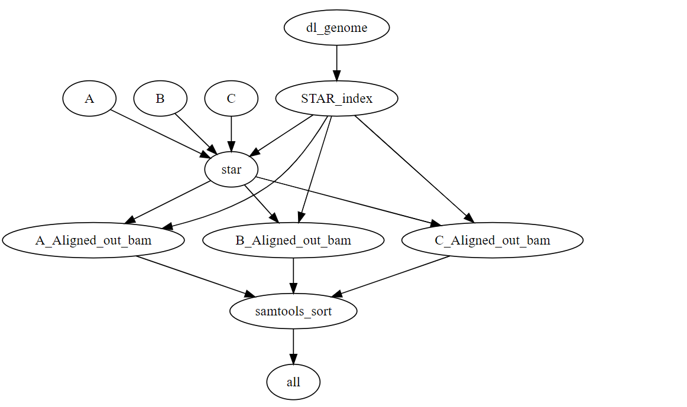

# Project 1 - Discussion Questions
Since we’ve used the first project as practice, these questions are meant to
help me assess how well I’ve conveyed some of the material as well as challenge
you to think conceptually about some of the underlying science. All of these
questions can be answered in a few sentences so do your best to be concise.

Remember, I will evaluate and give you feedback on your answers and allow you to
resubmit. As long as you address all of the comments in your resubmission, you
will receive full credit for this first project.

Open a Rstudio session to work on these questions. You may display any included


## Snakemake

Consider the following sample snakemake workflow and assume the files A.fq,
B.fq, and C.fq exist in the current working directory. (N.B. Some of these
commands in shell may not technically run, but the logic of the snakefile is
correct)

```
fa_fn = ‘ncbi_dataset/data/GCF_000001635.27/chr19.fa
gtf_fn= ‘ncbi_dataset/data/GCF_000001635.27/genomic.gtf
star_index = ‘Chr19_STAR_index’
FILES = [‘A’, ‘B’, ‘C’]

rule all:
	input:
	
		expand(‘{sample}.Aligned.out.bam’, sample=FILES)

rule dl_genome:
	output:
		fa = fa_fn,
		gtf = gtf_fn
	shell:
		‘’’
		datasets download genome accession GCF_000001635.27 
    –include gtf, genome
    –chromosomes 19
    
		unzip ncbi_dataset.zip
		‘’’

rule STAR_index:
	input:
		fa = fa_fn,
		gtf = gtf_fn,
	output:
		index=directory(star_index)
	threads: 4
	shell:
		‘’’
		STAR –runMode genome generate \
		–genomeDir {output.index} \
		–genomeFastaFiles {input.fa} \
		–sjdbGTFfile {input.gtf}
		‘’’
		
rule star:
	input:
		fq=’{sample}.fq’,
		index=’Chr19_STAR_index’
	output:
		‘{sample}.Aligned.out.bam’
	params:
		prefix = ‘{sample}.’
	shell:
		‘’’
		STAR –genomeDir {input.index} \
    –readFilesIn {input.fq} \
    –outSAMtype BAM Unsorted \
    –outFileNamePrefix {params.prefix}
    ‘’’
```

1. We’ve talked in class about how you can represent snakemake workflows visually.
Technically speaking, snakemake creates a directed acyclic graph that represents
the workflow. Draw the DAG for this sample snakemake workflow. Boxes indicate
the rules, and arrows indicate dependencies. Make this diagram in whatever
software you'd like and save it to this repo. Fill in the following code with the
name of the file you created and it will display it here in this markdown.

```{r, your image here}
knitr::include_graphics("my_workflow.PNG")
```


2. Write a valid snakemake rule that would run samtools sort on the outputs from
rule star. Name the outputs of this rule with the extension _sorted.bam.


rule samtools_sort:
    input:
        bam='{sample}.Aligned.out.bam'
    output:
        sorted_bam='{sample}.Aligned.sorted.bam'
    shell:
        'samtools sort {input.bam} -o {output.sorted_bam}'


3. Assume that we change our rule all input to be the following:
	
		expand(‘{samples}_sorted.bam’, samples=FILES)	

Re-draw the DAG assuming your rule from part 2 works as expected. Display it 
here using the following code:

```{r, your image here}

```


## RNAseq

1. List the major high-level steps of a basic RNAseq experiment to look for
differentially expressed genes. At each step, list what data you need to perform
each step and what format they are in (if applicable). At minimum, there are 4
essential steps.

the 4 essential steps are :-
1. Making a Library
   - Data Needed: RNA samples extracted from the experiment.
   - Format: RNA samples are converted into libraries suitable for sequencing.
   - This step involves preparing RNA samples for sequencing, typically including processes like RNA extraction, purification, and library construction. The format can be documented in a metadata file or a sample sheet providing information about the prepared RNA libraries.

2. Sequencing
   - Data Needed: Prepared RNA libraries.
   - Format: FASTQ files.
   - Utilizing high-throughput sequencing methods (e.g., Illumina, Ion Torrent, Oxford Nanopore) to generate FASTQ files containing short reads representing cDNA fragments.

3. Quality Control
   - Tools Used: FastQC, MultiQC.
   - Data Needed: FASTQ files.
   - Assessing the quality of sequencing data using FastQC to obtain detailed reports on sequence quality metrics, adapter contamination, etc. MultiQC aggregates and summarizes quality control results into a single report for easy comparison across multiple samples.

4. Alignment
   - Data Needed: Reference genome.
   - Format: Aligned sequences (BAM files).
   -  Mapping sequenced reads to the reference genome using special alignment algorithms (e.g., Bowtie, BWA, STAR) to determine their origin and generate BAM files containing aligned sequences.

5. Differential Expression Analysis
   - Data Needed: Aligned sequences, gene annotations (GTF/GFF).
   - Format: Tables of gene expression levels.
   - Identifying genes with significant expression differences between conditions, using tools like DESeq2 or edgeR. This step involves quantifying gene expression levels and performing statistical tests to detect differential expression.

6. Results
   - Format: Tables indicating gene expression levels and statistical measures (e.g., p-values, fold change).
   -The results obtained from the differential expression analysis provide insights into genes that are differentially expressed between experimental conditions.

7. Visualization
   - Format: Heatmaps, volcano plots.
   - Visualizing gene expression patterns using heatmaps and identifying differentially expressed genes using volcano plots. This step helps in understanding the overall gene expression landscape and identifying biological pathways enriched with differentially expressed genes..

2. Consider the following FastQC plot.

```{r}
knitr::include_graphics("fastqc_plot.png")
```


2a. What aspect of the data does this plot show?
- The Per sequence GC content plot gives the GC distribution over all sequences. 
- Each sequence is represented by a single data point on the plot, and the x-axis typically represents the GC content percentage, while the y-axis represents the number or proportion of sequences.


2b. Make an interpretation of this plot assuming the data type was RNASeq.
- Unlike genomic DNA, RNA is a single-stranded molecule, and the GC content may not be as stable across the entire transcriptome.
- Unusual patterns in the GC content plot, such as multiple peaks or unexpected shifts, might suggest issues like contamination, adapter contamination, or other artifacts.
- The broad, larger peak may suggest a diverse set of sequences with a range of GC content. This is common in RNA-Seq, reflecting the natural variability in RNA sequences.
- The sharp smaller peak may indicate a subset of sequences with a more specific GC content.This could be associated with a particular class of RNA or a specific biological process


2c. Do you think this plot indicates there was a problem with the dataset?
Explain your answer.
- Since the peak defference between the red line and the blue line is big there are chances that there can be a probelm with the datasets. it can be due to biological factors, such as the presence of different RNA species or experimental conditions, can contribute to this variability.
- or it can be due to contamination because the sharp peaks indicates contamination and in the above plot there are two peaks and the shorter one is sharp.


3. What is a splice-aware aligner? When is it important to use a splice-aware
aligner?
- A splice-aware aligner is crucial for accurately aligning sequencing reads to a reference genome in eukaryotic organisms, considering the presence of exons and introns. 
-Key scenarios for its importance include identifying splice junctions, handling gene fusion events, analyzing alternative splicing, managing exon skipping or inclusion, and quantifying transcript abundance in RNA-Seq studies.
-Notable splice-aware aligners like TopHat, HISAT2, and STAR enhance accuracy in mapping reads across exon-intron boundaries and facilitate a detailed analysis of complex gene structures. 
- They play a vital role in uncovering splicing events, ensuring precise alignment in studies involving RNA-Seq or spliced transcript data.

4. What does a “gene-level” count as produced by VERSE or any other counting
tool in a RNAseq experiment represent?
- A "gene-level" count, as determined by tools like VERSE, in In RNA-Seq experiments, represents the number of sequencing reads linked to a particular gene. represents the number of sequencing reads linked to a particular gene.  
- it occurs by the  RNA-Seq generates short sequences or reads from RNA samples.Then the Reads are aligned or mapped to the reference genome, determining which gene they come from.
- The count is the number of reads mapped to each specific gene.
-  Higher counts suggest higher gene expression, while lower counts indicate lower expression.
- Counts are normalized for factors like sequencing depth or gene length for comparison.
-  Gene-level counts are used to identify upregulated or downregulated genes in different experimental conditions.


5. In your own words, briefly describe what information the matching GTF for a
reference genome stores.
- The GTF file for a reference genome stores information about the gene features and structures in the genome.
- It includes details such as the coordinates of genes, exons, introns, and other essential elements. 
- The GTF file provides a map that helps bioinformatics tools correctly interpret and annotate sequencing data, especially in RNA-Seq experiments. 
- It guides the analysis software on where genes are located, how they are structured, and where important regions like exons and introns are positioned within the genome.


6. When counting alignments using VERSE or any other utility, why do we need to
provide the matching reference genome GTF file?
- When we're counting alignments in RNA-Seq, using tools like VERSE, it's important to include the matching reference genome GTF file because it contains vital information about the structure of genes—like where the coding parts (exons) and non-coding parts (introns) are located. 
- It is like  a roadmap that helps the computer understand the layout of the genome. By providing this roadmap, we guide the alignment process, making sure that sequencing reads are correctly matched to their corresponding genes, especially when it comes to tricky areas like exon-intron boundaries. 
-The GTF file is like a key that helps us accurately count reads associated with specific gene features, allowing us to measure gene expression levels. It's crucial for understanding the complexity of genes, including alternative splicing, and supports more detailed analyses like figuring out which genes are more active in different conditions. 
- Hence, it ensures that our analysis is on the right track, helping us make sense of the biological story hidden in the RNA data.


7. Let’s pretend that this was a GSEA result from an experiment where we treated
293T cells with a drug and compared changes in gene expression to wild-type
cells treated with a vehicle control. The differential expression results are
relative to the control cells (i.e. a positive fold change means a gene is
upregulated upon treatment with the drug)

Assume the following result is statistically significant with a positive NES
(normalized enrichment score) and that it represents a GSEA experiment performed
on the entire list of genes discovered in the experiment ranked by
log2FoldChange (i.e. genes that are “upregulated” in the cells treated with drug
are on the “left” and genes that are “downregulated” due to treatment are on the
“right”).

```{r}
knitr::include_graphics("gsea_plot.png")
```


7a. Form a valid interpretation / conclusion of the results shown in the plot
given the above setup.
- according to the plot the enrichment score is more than 0.5. and the rank is less than 2000 for the maximum deviation. Hence here the most significant gene is found since it has higher enrichment socre.
- in the middle part, the bar represents a gene from the pathway being mapped on the same location as the whole dataset, genes on the  right side are highly expressed and vice versa.
- In the last part,we can observe that positive rnaks are on the left and negative are on the right hence signifying to the normal phentype. Most upregulated genes are on left and most downregulated on right.

7b. Now consider that all of the genes driving
of the inflammatory pathway. Does your interpretation change and if so, how?
- According to the above conclusion it emphasizes strong association with the imflamatory pathway. It also provides insights into specific gene expression patterns within the pathway. and highlights directionality of gene expression changes related to inflammation.


7c. Finally, consider that all of the genes driving the enrichment all function
to inhibit inflammation. Does your interpretation change and if so, how?
- No the interpretation will reamin same since it is already neagtive corelated.


## O’Meara et al. Transcriptional Reversion of Cardiac Myocyte Fate During
Mammalian Cardiac Regeneration. Circ Res. Feb 2015. PMID: 25477501


1. Write out a methods section describing what steps of the analysis you performed
and which tools you used. Style this section as you would find a methods section
in a scientific publication. Remember to include the important details that
would allow a third party to reproduce your exact analysis. You can safely
exclude details that do not affect the underlying results.


- Obtained raw sequencing reads in FASTQ format for all 16 samples from the paper but taking only small samples.
- Used FastQC version 0.11.9 (Babraham Bioinformatics) for quality control analysis of sequencing reads.
- Filtered out low-quality reads and trimmed very short reads using FastQC's built-in functionalities.
- Employed MultiQC version 1.10 to aggregate and summarize FastQC results across all samples.
- Downloaded the primary assembly genome FASTA file for m33 from 'https://ftp.ebi.ac.uk/pub/databases/gencode/Gencode_mouse/release_M34/GRCm39.primary_assembly.genome.fa.gz'
and its corresponding gene transfer format (GTF) file from 'https://ftp.ebi.ac.uk/pub/databases/gencode/Gencode_mouse/release_M34/gencode.vM34.primary_assembly.annotation.gtf.gz'	.
- Implemented a Snakemake rule to decompress the GTF file while preserving the original compressed file.
- Aligned sequencing reads to the reference genome using STAR version 2.7.9a.
- Generated eight unsorted BAM files for each sample in the dataset.
- Utilized Samtools version 1.13 to assess alignment quality of BAM files using the `flagstat` command.
- Produced separate .txt files for each BAM file containing alignment statistics.
- Conducted expression quantification using VERSE (Virtual Expression RNA-Seq), an in-house tool, on each BAM file to quantify gene expression levels.
- Implemented a Snakemake rule and custom Python script named `filter_cts_mat.py` to retain genes with non-zero counts in every sample.
- Created a mapping file of gene IDs to gene symbols using another Snakemake rule and Python script named `parse_gtf.py`, facilitating downstream analysis and interpretation.
- Performed differential expression analysis comparing timepoints P0 and AD using resulting in a tibble containing statistical information.
- Joined gene names into the results tibble while preserving original information to facilitate interpretation.
 - Conducted GSEA using fgsea (Korotkevich et al., 2021) to identify enriched biological pathways or gene sets associated with differential expression.
- Utilized a combination of tidyverse and base R functions to create plots resembling those from Figure 1D, providing visual representations of the analyzed data.

2. Why did the authors perform RNAseq on these specific samples? What was their
goal in doing so?
- The authors conducted the RNAseq on neonatal mice to characterize the transcriptional landscape associated with cardiac myocyte (CM) after heart injury.
- So they can identify the fundamental transcriptional signature unique to injury-induced cardiac myocyte (CM) regeneration, providing insights into the underlying molecular mechanisms propelling this regenerative process.
 - The research aimed to figure out if heart cells (CMs) change their gene instructions back to a less specialized state during regeneration. 
 

3. Using either your GSEA results OR your replication of Figure 1D, draw a conclusion
about the main result this RNAseq experiment shows. Do your results generally
agree with those of the original publication?
- Yes my result is slightly similar to those of the publications but since the data we have taken is shortened and not the whole datasets are taken there is difference in my result and the publication result.
- like for example there is fpkm values similar to resulys but there exteme values are similar that is the highest and the lowest but the values in between can be different.

4. List at least two reasons why your results may be **slightly** different than
those found in the original publication.

- The results are different because we have take the small samples and because of that we are getting the extreme  varitaion in values. Hence the genes are expressing one extreme or the other there are very less in between.
- RNAseq data requires preprocessing and normalization steps. Variations in these procedures, such as different software versions or parameter settings, can lead to subtle differences in the final results.Summary of Findings with Directionality:
- Mitochondrial Genes:Upregulation suggests increased mitochondrial activity or biogenesis, while downregulation may indicate regulatory mechanisms.
- Sarcomere-Related Genes:Mixed expression patterns suggest both enhanced muscle contractility (upregulation) and potential structural alterations (downregulation).
-  Cell Cycle-Related Genes:Upregulation indicates enhanced cellular proliferation, while downregulation suggests regulatory control over cell cycle progression.


